# EpistemicNetworkAnalysis.jl

A port of [rENA](https://rdrr.io/cran/rENA/) version 0.2.0.1 into native Julia.

Original R package by [http://www.epistemicnetwork.org/](http://www.epistemicnetwork.org/).

IN DEVELOPMENT

## Tests

(as of [22d915d](https://github.com/snotskie/EpistemicNetworkAnalysis.jl/commit/22d915dd917824799d00f6436e03b74bd234772f))

Means rotation:

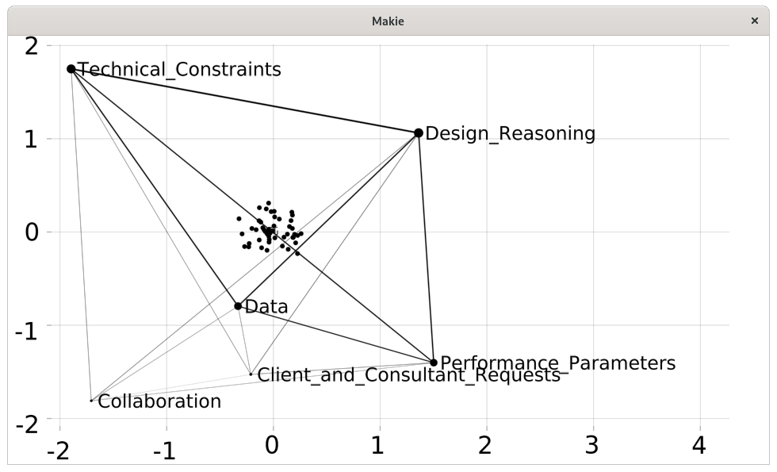

Means rotation, group alignment plot:

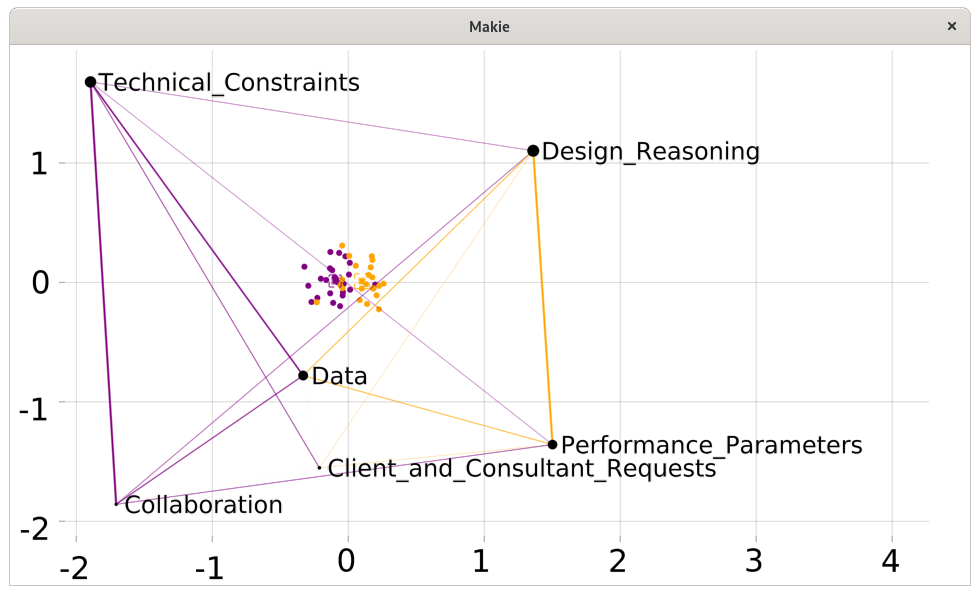

Means rotation, group alignment plot, detail showing target projections:

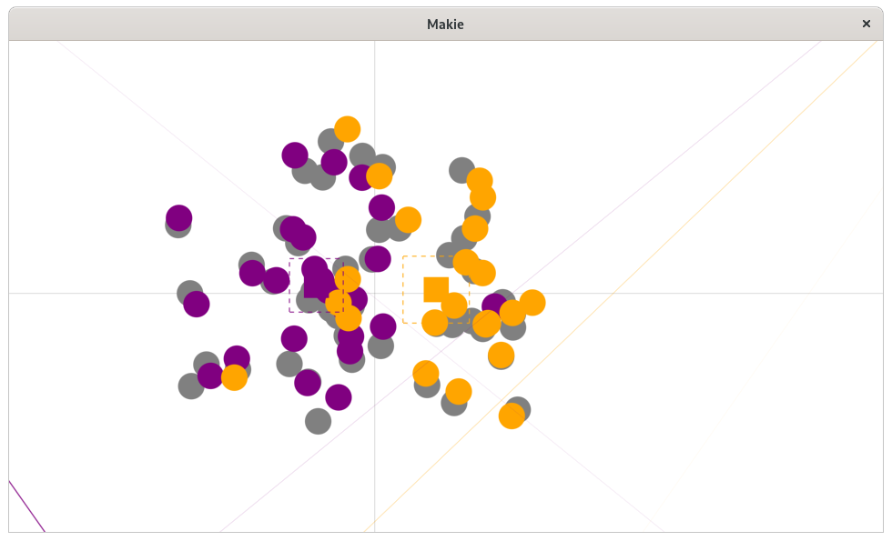

SVD rotation:

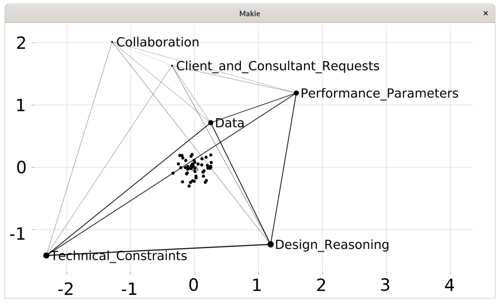

SVD rotation, group alignment plot:

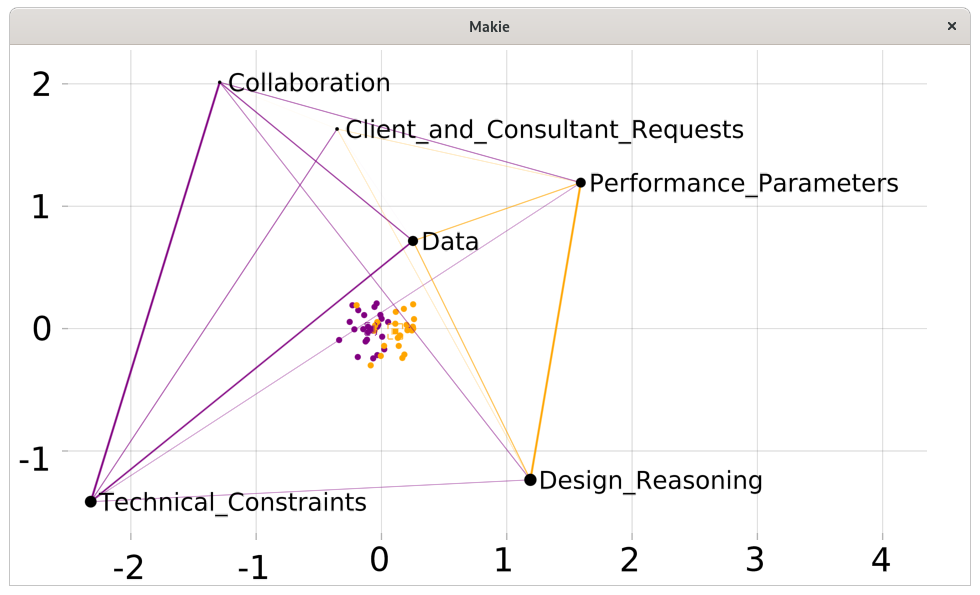

SVD rotation, group alignment plot, detail showing target projections:

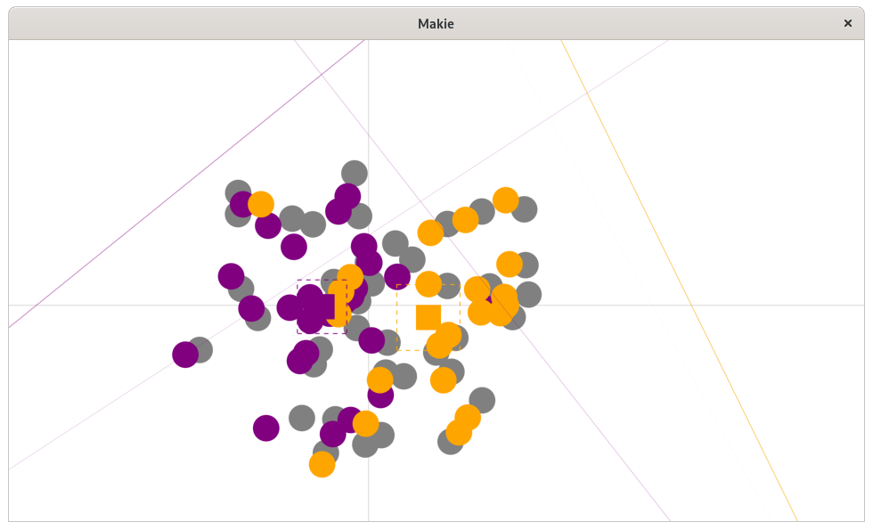

Regression rotation:

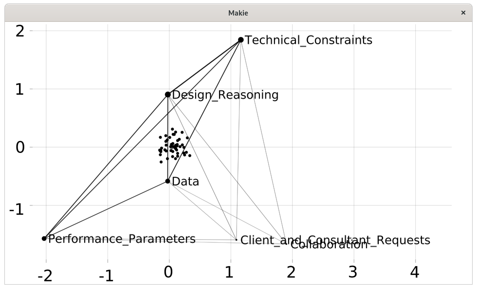

Regression rotation, group alignment plot:

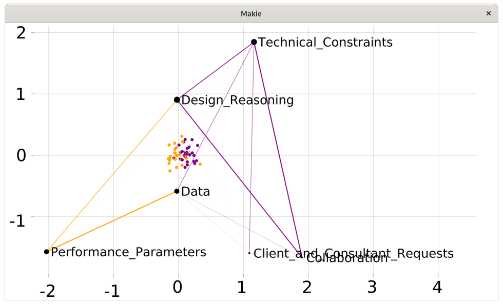

Regression rotation, group alignment plot, detail showing target projections:

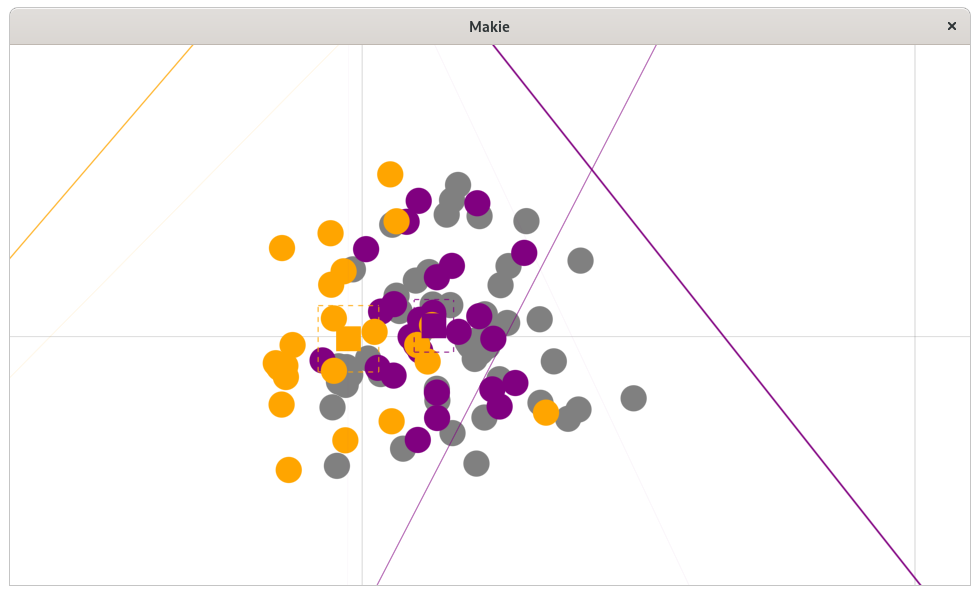

Moderated means rotation:

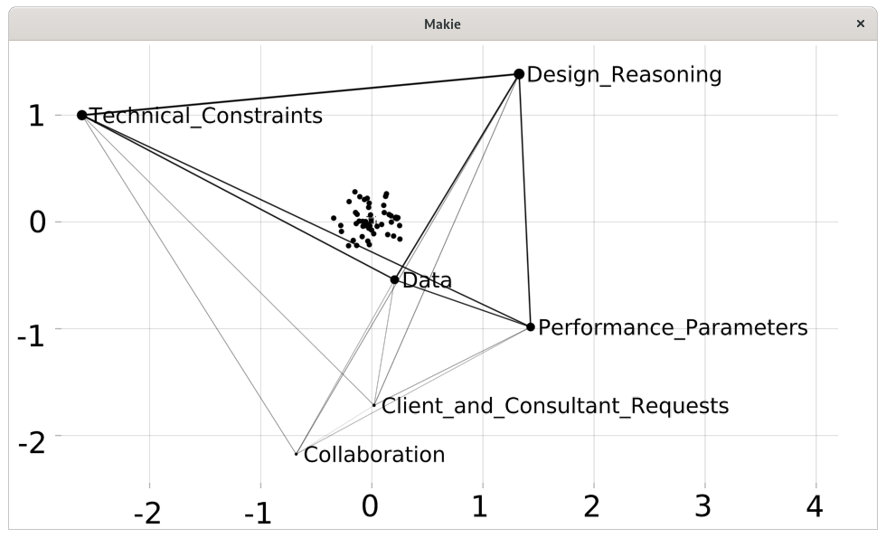

Moderated means rotation, group alignment plot:

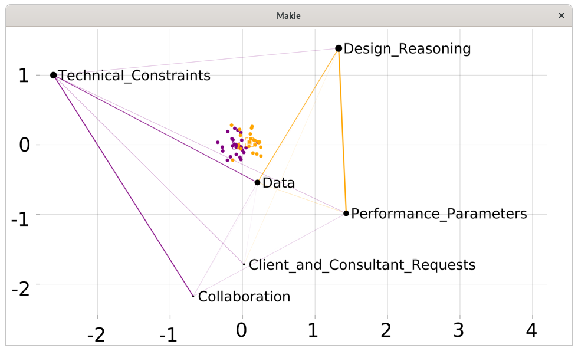

Moderated means rotation, group alignment plot, detail showing target projections:

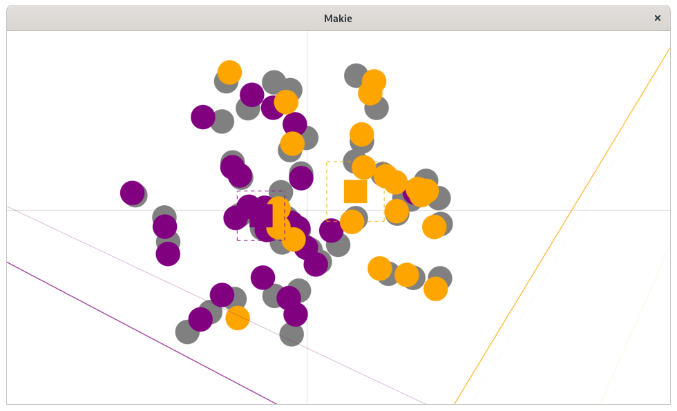

AC-SVD rotation:

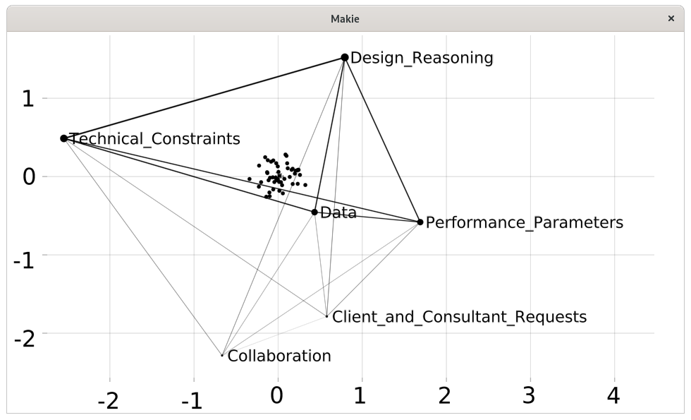

AC-SVD rotation, group alignment plot:

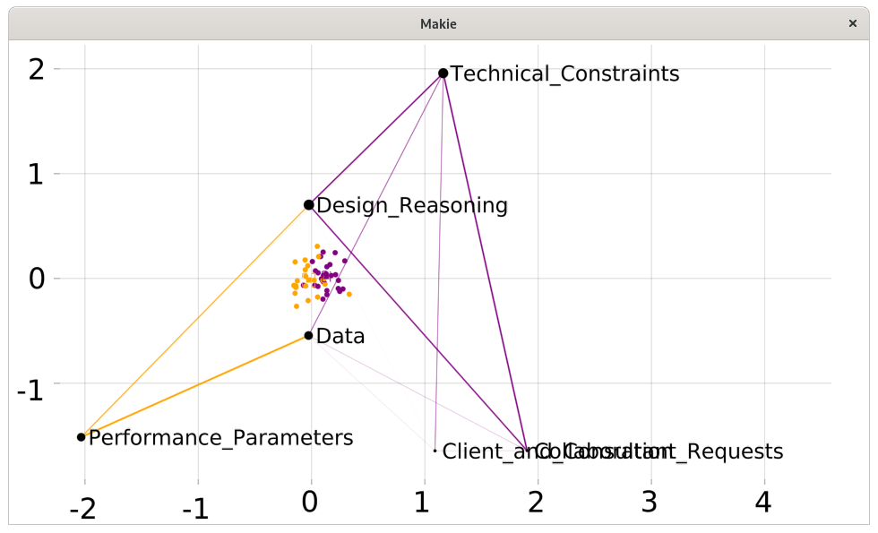

AC-SVD rotation, group alignment plot, detail showing target projections:

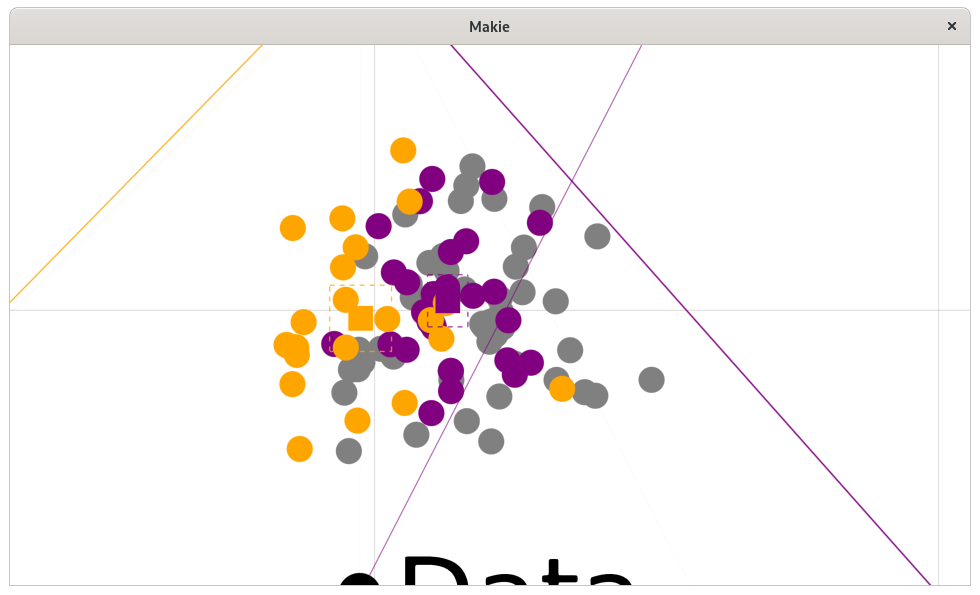