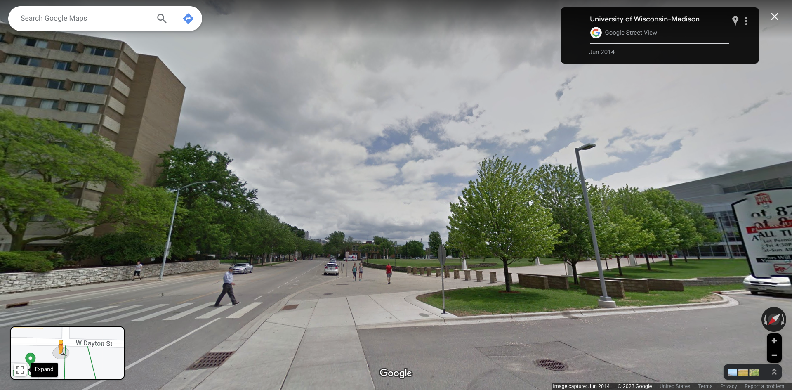

# ICQE23 ENA Rotations Workshop

```@raw html
<style type="text/css">
.admonition.is-category-discussion {
    background-color: #f2e9ff;
    border-color: #9b59b6;
}
.admonition.is-category-discussion>.admonition-header {
    background: #9b59b6;
}

.admonition.is-category-activity {
    background-color: #d9eafc;
    border-color: #45aaf2;
}
.admonition.is-category-activity>.admonition-header {
    background: #45aaf2;
}

.admonition.is-category-challenge {
    background-color: #ffccc7;
    border-color: #e74c3c;
}
.admonition.is-category-challenge>.admonition-header {
    background: #e74c3c;
}

.admonition.is-category-checkin {
    background-color: #e9f7ef;
    border-color: #27ae60;
}
.admonition.is-category-checkin>.admonition-header {
    background: #27ae60;
}
</style>
```

## What to Bring

For this workshop you'll need:

- 💻 Your laptop, setup as described below so we can hit the ground running
- 🔌 Laptop charger
- 🎉 A can-do attitude and an unshakeable curiousity
- 🗂️ Any data you would like to work on, help thinking about, etc.

Prerequisites:

- All learners welcome!
- You should already be familiar with ENA. If you aren't, the morning "Introduction to Epistemic Network Analysis" workshop before ours is a great place to start!
- You should have at least a beginner's understanding of one programming language. If you don't, [Kaggle's Intro to Programming](https://www.kaggle.com/learn/intro-to-programming) is a great place to start!
- You do not need experience with Julia or VS Code. We will introduce them as necessary during the workshop

You will learn:

- All about rotations in ENA
- How to make lots of models
- How to choose the right model
- How to get help and contribute long after the conference ends

## Before the Conference: Setup and Survey

Before the conference begins:

1. [Install Julia](https://julialang.org/downloads/)
2. [Install VS Code](https://code.visualstudio.com/download)
3. [Install Julia VS Code extension](https://code.visualstudio.com/docs/languages/julia#_getting-started)
4. Close and restart VS Code
5. Install `EpistemicNetworkAnalysis.jl` by:
    1. Create a new file in VS Code (`ctrl+n`, or `cmd+n` on Mac)
    2. Save it with the name `setup.jl` (`ctrl+s`, or `cmd+s` on Mac). Save it in a location that will be easy for you to find later, such as in a folder on your Desktop or in your Downloads folder
    3. Copy the following code into that file and save the changes:

       ```julia
       # Install ENA package
       using Pkg
       Pkg.add(url="https://github.com/snotskie/EpistemicNetworkAnalysis.jl")
       ```

    4. Run the file by pressing the Run icon (looks like a "play button" or triangle pointing to the right, located toward the top-right of the VS Code window). Note, the first time you run this code may take some time to complete. If your VS Code window says `Julia:Evaluating` in the bottom left, then your code is still running
5. Once everything is installed, test that it works by:
    1. Create a new file in VS Code
    2. Save it with the name `main.jl`
    3. Copy the following code into that file and save the changes:

       ```julia
       # Load ENA package
       using EpistemicNetworkAnalysis

       # Load sample dataset, codes from my first year on hormone replacement therapy
       data = loadExample("transitions") # NOTE: To load your own data, see DataFrame(CSV.File(...))

       # Derive some new codes based on old ones
       deriveAnyCode!(data, :BODY, :Changes, :Mood, :Oily, :Dysphoria, :Cry)
       deriveAnyCode!(data, :REFLECT, :Identity, :Longing, :Dream, :Childhood, :Family, :Name, :Letter, :Doubt, :Religion)
       deriveAnyCode!(data, :LEARN, :WWW, :Experiment, :Recipe)
       deriveAnyCode!(data, :PROGRESS, :Strangers, :Passed, :Out, :Affirmation)

       # Add new columns for splitting the year's data in half, third, ...
       data[!, :All] .= "All"
       data[!, :Half] .= "First"
       data[183:end, :Half] .= "Second"
       data[!, :Third] .= "First"
       data[122:243, :Third] .= "Second"
       data[244:end, :Third] .= "Third"
       data[!, :Fourth] .= "First"
       data[92:183, :Fourth] .= "Second"
       data[184:275, :Fourth] .= "Third"
       data[276:end, :Fourth] .= "Fourth"

       # List columns to use as codes, convos, and units
       codes = [:DoseTracking, :SkippedDose, :Happy, :NonHappy, :Sweets, :BODY, :REFLECT, :LEARN, :PROGRESS]
       conversations = [:Date]
       units = [:Date]

       # Run the model and plot it
       model = ENAModel(data, codes, conversations, units)
       p = plot(model)
       display(p)
       ```

    4. Run the file by pressing the Run icon. Note, the first time you run this code may take some time to complete
    5. If an ENA plot appears, congrats! Everything is setup and ready to go for the workshop!
5. [Complete the prior knowledge survey](https://forms.gle/8QVEy6NxnQCY9tBz9) to help us plan and tell us a little about yourself

If you have any problems and questions during setup at all, [please let me know](mailto:mariah.knowles@wisc.edu?subject=ICQE23+Setup+Question) and we'll get you squared away!

## Intro

This is a 2-hour tutorial workshop

Workshop Goals:

- Give QE researchers the power to choose and develop custom rotations to fit their research aims, by introducing them to open-source ENA-based tools
- Learners will be able to (a) create and interpret ENA models that have rotations beyond SVD and means rotation
- (b) understand the steps of the ENA algorithm and the connections between rotation choice and research aims
- (c) use Github issues to get assistance, troubleshoot problems, and contribute to ENA API development

Workshop Audience:

- QE researchers
- already familiar with ENA
- a beginner's understanding of at least one programming language
- who want to use rotations beyond SVD and means rotation in their own research (or understand more about rotations in the first place)

Workshop structure:

- Live-coding / code-along model
- Three phases:
    1. Demo how to make several different models with different rotations with one running example
    2. Discussion on choosing the right rotation for the job, based on your gut sense of your research story
    3. Looking ahead discussion, sharing pathways for contributing and getting help after the workshop

Code of Conduct:

- Use welcoming and inclusive language
- Be respectful of different viewpoints and experiences
- Gracefully accept constructive criticism
- Focus on what is best for the community
- Show courtesy and respect towards other community members

[Full CoC](https://docs.carpentries.org/topic_folders/policies/code-of-conduct.html)

If you would like to report any misconduct, contact a Data Science Hub Facilitator: <facilitator@datascience.wisc.edu>

**Collaborative Notes**

We use Etherpad to write notes collaboratively, link to be given during the event

Notes and code will be added as the instructor presents the material

**Have conceptual questions?**

Get the instructor’s attention by raising your hand

**Encounter a bug?**

Get a helper’s attention by raising your hand or putting your name card on its side with the red facing up

Setup check: green side up if they completed setup before the workshop

!!! discussion

    - Green card up if you want to participate in introductions
    - Name, (pronouns), where are you coming from?
    - What are you excited to learn from this workshop?
    - Or, what is one question you have? (Keep running questions on the board)

## Demo and Worked Example

### Dataset

The dataset we'll be using are codes and metadata from my first year on hormone replacement therapy. I'm a transgender woman, Valentines Day 2020 I started my medical transition, and I kept a daily record in various ways on my phone that first year. Also that year I learned QE and started developing tools for ENA. As a test case, I coded my own data, [modeled it](https://link.springer.com/chapter/10.1007/978-3-030-93859-8_8), and more recently made it available. (Though, just the codes and metadata, not the text of the daily entries, given their private nature)

This dataset is packaged with `EpistemicNetworkAnalysis.jl`, so you can [preview it on GitHub](https://github.com/snotskie/EpistemicNetworkAnalysis.jl/blob/master/data/transitions.csv)

!!! activity

    - Preview the data with your partner
    - What stands out to you about what the data contains?
    - What metadata columns do we have and how might we use them?
    - At a skim, are their codes that have way more 1s than others?

### Getting Started

We'll start where the setup instructions left off:

```@example runningExample
# Load ENA package
using EpistemicNetworkAnalysis

# Load sample dataset, codes from my first year on hormone replacement therapy
data = loadExample("transitions")

# Derive some new codes based on old ones
deriveAnyCode!(data, :BODY, :Changes, :Mood, :Oily, :Dysphoria, :Cry)
deriveAnyCode!(data, :REFLECT, :Identity, :Longing, :Dream, :Childhood, :Family, :Name, :Letter, :Doubt, :Religion)
deriveAnyCode!(data, :LEARN, :WWW, :Experiment, :Recipe)
deriveAnyCode!(data, :PROGRESS, :Strangers, :Passed, :Out, :Affirmation)

# Add new columns for splitting the year's data in half, third, ...
data[!, :All] .= "All"
data[!, :Half] .= "First"
data[183:end, :Half] .= "Second"
data[!, :Third] .= "First"
data[122:243, :Third] .= "Second"
data[244:end, :Third] .= "Third"
data[!, :Fourth] .= "First"
data[92:183, :Fourth] .= "Second"
data[184:275, :Fourth] .= "Third"
data[276:end, :Fourth] .= "Fourth"

# List columns to use as codes, convos, and units
codes = [:DoseTracking, :SkippedDose, :Happy, :NonHappy, :Sweets, :BODY, :REFLECT, :LEARN, :PROGRESS]
conversations = [:Date]
units = [:Date]

# Run the model and plot it
model = ENAModel(data, codes, conversations, units)
p = plot(model)
display(p)
using Plots # hide
mkdir("icqe23") # hide
savefig(p, "icqe23/opening-example.svg"); nothing # hide
```


!!! checkin

    - Green cards up if you would like me to speed up?
    - Green cards up if you would like me to slow down?

!!! activity

    - Try removing different combinations of codes from the model
    - What impact does that have?
    - Do some codes have more impact than others? In what ways?

### Plot Interpretation

`plot(model)` produces a plot with the following subplots:

- `(a)` an overall mean, which tells us the baseline everything compares against
- `(b)` and `(c)` rates of change for each connection across the x- and y-axes, which gives us a clue about what is being modeled by each axis. If you are coming up with a name for the x-axis, it's good to check your assumptions against these trends and make sure they lign up
- Subsequent subplots show each subgroup on its own. It's good to compare these to the overall mean
- And the last subplots show how each pair of subgroups compare. Similar to the trend plots, these show you *what* is being modeled by the difference of the two groups. If everything looks grey, then it's hard to give a succinct description of that difference: there's just a lot of noise

Some differences from WebENA and rENA:

- Saturation shows *correlation strength* so we can tell at a glance when a model might be weak. In WebENA and rENA saturation is redundant (not a bad thing) with line thickness, which shows magnitude of an effect
- Plots are mean centered by moving the origin of the plot, not by changing the underlying data. This preserves information that may or may not be useful for downstream analyses
- Plots are opinionated. Based on the model config, the plot's default settings change to what I believed was the best way to plot that kind of model. This gives you the "right" plot without having to specify what "right" means each time
- A [known issue](https://github.com/snotskie/EpistemicNetworkAnalysis.jl/issues/11) is that the y-axis label can get cutoff when there are a lot of subplots

!!! discussion

    - What does the story of the plot seem to be so far?
    - What information seems to be missing?

### Conversation, Window Size, and Empty Units

As is, each day is its own "conversation," meaning no connections are made from day to day. Instead, lets change the conversation to the whole year:

```@example runningExample
conversations = [:All] # :All is a column we made that just contains the word "All"
model = ENAModel(data, codes, conversations, units) # hide
p = plot(model) # hide
savefig(p, "icqe23/all-convo.svg"); nothing # hide
```


That's better, I guess. But let's inspect the model to see what's going on:

```julia
display(model)
```

Notice this part of the output:

```txt
 ModelConfig =
     (codes = [:DoseTracking,
               :SkippedDose,
               :Happy,
               :NonHappy,
               :Sweets,
               :BODY,
               :REFLECT,
               :LEARN,
               :PROGRESS],
      conversations = [:All],
      units = [:Date],
      unitFilter = ...,
      edgeFilter = ...,
      windowSize = Inf, <--- This part right here
      sphereNormalize = true,
      dropEmpty = false,
      recenterEmpty = false),
```

By default, the window size in this package is infinite, meaning any connection between any codes in the whole conversation are counted. Let's pick a more sensible window:

```@example runningExample
model = ENAModel(
    data, codes, conversations, units,
    windowSize=4
)
p = plot(model) # hide
savefig(p, "icqe23/window-4.svg"); nothing # hide
```


Getting better. But one more tweak. Let's tell the model what to do with empty units. David's convinced me that the best place to put them is in the mean or center of the plot. This has advantages for proper stats tests later

```@example runningExample
model = ENAModel(
    data, codes, conversations, units,
    windowSize=4,
    recenterEmpty=true
)
p = plot(model) # hide
savefig(p, "icqe23/recenter-empty.svg"); nothing # hide
```


Significantly better!

!!! activity

    - Try changing the value of `windowSize` a few times
    - What kind of impact does that have on the model?
    - What does changing the `windowSize` mean when qualitatively when thinking about data that moves over a year?

### Plot Tweaks

This is data that moves over time. And other projects I know have data that moves over different continuous variables, like grades or so on. Let's color code our plot to make that pop:

```@example runningExample
p = plot(
    model,
    spectralColorBy=:Day
)
savefig(p, "icqe23/spectral-day.svg"); nothing # hide
```


Alternatively, we could split the year's data in half and color code by that instead:

```@example runningExample
p = plot(
    model,
    groupBy=:Half # :Half is a column we added that says "First" then "Second"
)
savefig(p, "icqe23/group-half.svg"); nothing # hide
```


!!! activity

    - Try splitting it in thirds (`groupBy=:Third`) or in fourths (`groupBy=:Fourth`)

!!! discussion

    - Which version of the plot shows the most information?
    - What story are you starting to see emerge from the data?
    - Or how is your sense of the story changing as we show it in different ways?

### Rotations

The first and second halves seem different. Let's rotate the model to make that focus explicit:

```@example runningExample
rotation = MeansRotation(:Half, "First", "Second")
model = ENAModel(
    data, codes, conversations, units,
    windowSize=4,
    recenterEmpty=true,
    rotateBy=rotation
)
p = plot(model) # hide
savefig(p, "icqe23/mr-half.svg"); nothing # hide
```


Turns out, in this data, the default SVD rotation was nearly identical to that means rotation

But, a person's experience over a year can't be summed up as just a before and an after, right? Let's split the year in thirds and make that three-way difference the focus:

```@example runningExample
rotation = MulticlassRotation(:Third)
model = ENAModel( # hide
    data, codes, conversations, units, # hide
    windowSize=4, # hide
    recenterEmpty=true, # hide
    rotateBy=rotation # hide
) # hide
p = plot(model) # hide
savefig(p, "icqe23/mcmr-third.svg"); nothing # hide
```


That's starting to feel better

Let's try splitting the year in fourth next:

```@example runningExample
rotation = MulticlassRotation(:Fourth)
model = ENAModel( # hide
    data, codes, conversations, units, # hide
    windowSize=4, # hide
    recenterEmpty=true, # hide
    rotateBy=rotation # hide
) # hide
p = plot(model) # hide
savefig(p, "icqe23/mcmr-fourth.svg"); nothing # hide
```


The "arc" of the year is starting to take shape

But wow! That's a lot of subplots. Let's pull out just one for now:

```@example runningExample
sp = plot(p.subplots[1], size=(700,700))
display(sp)
savefig(sp, "icqe23/mcmr-fourth-sp1.svg"); nothing # hide
```


!!! activity

    - Try running a multiclass rotation using `:Half` as the grouping variable
    - How does this compare to the means rotation? Why do you think that is?

!!! challenge

    Run a model that compares thirds of the year. Plot just the subplot that compares the first and second third. Make sure the plot is zoomed enough for a legible plot

!!! discussion

    We've seen this data modeled a lot of different ways now. Which codes seem to really be driving the story the most?

Let's model that assumption directly:

```@example runningExample
rotation = TopicRotation("HRT?", [:SkippedDose], [:Happy])
# ...
model = ENAModel( # hide
    data, codes, conversations, units, # hide
    windowSize=4, # hide
    recenterEmpty=true, # hide
    rotateBy=rotation # hide
) # hide
p = plot(
    model,
    spectralColorBy=:Day
)
savefig(plot(p.subplots[1], size=(700,700)), "icqe23/topic-spectral.svg"); nothing # hide
# or
p = plot(
    model,
    groupBy=:Fourth
)
savefig(plot(p.subplots[1], size=(700,700)), "icqe23/topic-fourth.svg"); nothing # hide
```


That seems to be pretty close. The spectral plot still has a lot of red in the middle though. I'd like it to make clear "stripes" of color if possible. And being familiar with this data (having lived it), I know that there's a little more to the story than just those two codes

```@example runningExample
rotation = TopicRotation("HRT", [:SkippedDose, :DoseTracking], [:Happy, :PROGRESS])
model = ENAModel( # hide
    data, codes, conversations, units, # hide
    windowSize=4, # hide
    recenterEmpty=true, # hide
    rotateBy=rotation # hide
) # hide
p = plot( # hide
    model, # hide
    spectralColorBy=:Day # hide
) # hide
savefig(plot(p.subplots[1], size=(700,700)), "icqe23/topic-redo-spectral.svg"); nothing # hide
p = plot( # hide
    model, # hide
    groupBy=:Fourth # hide
) # hide
savefig(plot(p.subplots[1], size=(700,700)), "icqe23/topic-redo-fourth.svg"); nothing # hide
```


Much better

!!! challenge

    Several codes are getting "clumped" together near the middle. Create a model that forces two of those codes to the left and two of those codes to the right, then plot it.

Coming up with that HRT model was a lot of work, especially since I had to tell you the answer I came up with from a lot of qualitative work

But what if we just wanted to ask, show me the model that captures time, linearly, and with early on the left and late on the right?

To do that, we first need to add a linear modeling library:

```julia
using Pkg
Pkg.add("GLM")
```

Then we can use it as part of a rotation:

```@example runningExample
using GLM
# ...
rotation = FormulaRotation(
    LinearModel, @formula(y ~ 1 + Day), 2, nothing
)
model = ENAModel( # hide
    data, codes, conversations, units, # hide
    windowSize=4, # hide
    recenterEmpty=true, # hide
    rotateBy=rotation # hide
) # hide
p = plot( # hide
    model, # hide
    spectralColorBy=:Day # hide
) # hide
savefig(plot(p.subplots[1], size=(700,700)), "icqe23/formula-spectral.svg"); nothing # hide
p = plot( # hide
    model, # hide
    groupBy=:Fourth # hide
) # hide
savefig(plot(p.subplots[1], size=(700,700)), "icqe23/formula-fourth.svg"); nothing # hide
```


!!! discussion

    Which rotations are you most likely to use in your own work? Why?

### Exporting Results and Importing your own Data

Two useful functions for exporting your results are `to_xlsx` and `savefig`:

```julia
to_xlsx("example.xlsx", model)

using Plots
p = plot(model)
savefig(p, "example.png")
```

We use `loadExample` to load one of the pre-baked example datasets. To load your own data, you use the `DataFrames` and `CSV` packages:

```julia
using DataFrames
using CSV
data = DataFrame(CSV.File("example.csv"))
```

Remember, you may first have to add these packages with `Pkg.add("Plots")` etc.

!!! tip

    When preparing your data for ENA, it is a good idea to remove any spaces or punctuation from your column names. Choose short, proper case nouns. You can always spell things out further in your codebook

## Choosing Models

A big part of choosing the right model is telling stories

!!! discussion

    1. Pair up. Pick your favorite version of the model we've run so far and use it to write a summary of the year's data, in less than 80 words. As needed, you can check your understanding against the [codebook](https://link.springer.com/chapter/10.1007/978-3-030-93859-8_8/tables/1)
    2. Whose story is the right version of the story to tell? Is yours the right version of the story to tell? How would you even judge that?
    3. This data is about me. If I told you your telling of the story felt weird to me, would that affect your answer?
    4. Did your model affect the way you structured your story? How so?

Here we made the model first and told the story second. Let's try it the other way

!!! activity

    1. Put the image below on the board
    2. Split the group in half: ethnographers and ethnographers-of-ethnographers
    3. Ethnographers: How would you describe this image? Discuss and put sticky note labels right on the TV. Label everything you see
    4. E-o-Es: Watch their discussion and take notes
    5. When done, take the image away, leaving just the stickies
    6. E-o-Es: What did you observe and what do you see going on up here?
    7. Ethnographers: Watch their discussion and take notes
    8. When done, Ethnographers: What did you observe?

    

Stories have structure, and these structures have a geometry to them:

- We talk about some set of events because they share some sense of similarity
- We move onto the next paragraph where we talk about a different set of events sharing a different similarity
- And we hang those paragraphs together into a larger narrative structure
- These narratives have a geometry to them: over here is this, and over here is this, and here's how the qualities change as we move around from point to point, from paragraph to paragraph

ENA helps us capture that geometry. The ENA process as a whole has five steps:

1. Accumulate connection counts between qualitative codes over a sliding window. This gives a high dimensional matrix representation of one's discourse
2. Embed a network into that space as a way to approximately understand how the model weights change as one moves through the space
3. Reduce the dimensionality of that space to highlight one's features of interest. This is called dimension reduction, multidimensional scaling, or rigid body rotation in QE-land
4. Visualize that reduced space
5. Interpret the results

All these steps are agnostic to your sense of your narrative structure, except for the third, the dimension reduction step. It's in that step that the algorithm chooses which information to show and which to hide. Ideally, your dimension reduction lets you think on the plot the same way you think on the page—over here is this, and over here is this—, letting you (a) move through the story as feels natural while (b) retaining exactly the information you need to tell and test that kind of story

Our sense of our story should *drive* our ENA models. And when the two conflict, we should figure out why and extend ENA to fit

To get us started, I've tried to build into `EpistemicNetworkAnalysis.jl` enough rotations that I believe are flexible enough to handle the bulk of cases

- `SVDRotation`: The default. Use this to get a high level view of your data. A *really* good place to start. Rarely the best place to stop
- `MeansRotation`: Use this to compare exactly two groups. Use this to compare exactly two groups that are each divisible into exactly two sub-groups
- `MulticlassRotation` and `LDARotation`: Use these to compare multiple groups. When you have a continuous variable, it's likely that your story still moves over discrete touchpoints, eg., low-scoring students, early days in the year, etc. Let your sense of your story guide how you split up your data into groups, then compare those groups
- `TopicRotation`: Use this to check prior theory, or your own inferences, about how codes will affect a model. We do a lot of thinking from our inferences about what a model is capturing. This rotation lets you make that thinking explicit
- `FormulaRotation`: My feelings on this are similar to SVD. It's probably a good place to start, to see how your data compares to some variable. Pair it with a `spectralColorBy`. But it also probably isn't a good place to end, since linear regressions likely don't fit how we structure our tellings of the story. Even so, this rotation is incredibly flexible, so it can be a good starting point for creating other rotations
- `TrainedRotation`: Use this when you need to test a different rotation against a holdout test or validation set. It isn't a rotation in itself, but instead a useful piece of ENA machinery for perform certain kinds of model validity checks

!!! checkin

    Is there anything you would like me to review again or cover before we move on to getting help after the conference?

## Getting Help and Contributing

`EpistemicNetworkAnalysis.jl` lives on [GitHub](https://github.com/snotskie/EpistemicNetworkAnalysis.jl)

But not just that package. All of Julia lives on GitHub. Every Julia package, and even the language itself, by design are hosted on GitHub. This can make things difficult for people living in [some countries where GitHub is occasionally blocked or slowed](https://en.wikipedia.org/wiki/Censorship_of_GitHub). By and far though, this allows you to:

- See and report issues for all Julia packages, as well as propose your own fixes
- See the entire history of development and discussion for all Julia packages
- Easily find documentation for most Julia packages
- Engage in discussion with other users of some of your favorite packages
- Directly ask developers for help

Julia also has a [very active and welcoming discussion board](https://discourse.julialang.org/)

Julia has from the very beginning made open source development a part of how the language itself works. I really appreciate this because it builds community right into everything I do with it. You never code alone, and you never learn to code alone

While Julia takes this to the limit, other QE resources are also open to varying extents:

- rENA lets you see issues and development history on [gitlab](https://gitlab.com/epistemic-analytics/qe-packages/rENA/-/issues)
- Several workshops shared on [qesoc](https://qesoc.org/) via Google Drive:
    - ROCK workshop
    - Intro to ENA workshop
    - Advanced ENA workshop
    - rENA workshop
    - Intro to Automated Coding workshop

!!! discussion

    - Summarize with your neighbor in 15 words or less: What does `EpistemicNetworkAnalysis.jl` being open source mean to you?
    - What other QE open resources am I missing? Other not-specifically-QE-but-still-useful open resources?
    - What are you planning to do with ENA and ENA tools like `EpistemicNetworkAnalysis.jl` in the future? What kind of support or community would best help you on that?

## Closeout

Before we leave, let's plan some future activities:

- **Users:** If you are primarily planning on *using* `EpistemicNetworkAnalysis.jl` or tools like it, not *developing* new tools or extensions to them, schedule a post-conference check-in with me (TODO) to see how you're doing and help you along with your projects
- **Developers:** If you are planning on developing extensions to `EpistemicNetworkAnalysis.jl` or writing other tools like it, vote on a meetup time (TODO) for developers to get together and share what we're thinking and working on

Finally, thank you so so much! Whether you attended this workshop in person or you found these notes useful after the fact, [pop in and say hi](https://github.com/snotskie/EpistemicNetworkAnalysis.jl/discussions)!